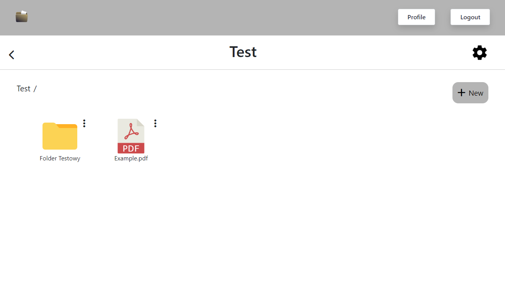
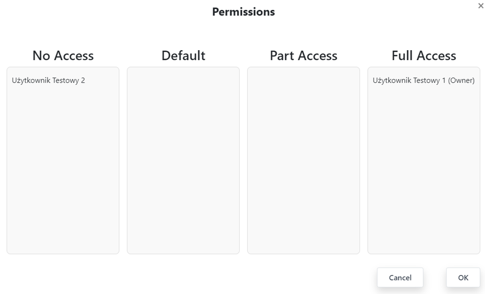

# 📁 Identity Management and Access Control System

## 🔒 Project Description

This system provides **secure identity management** and **precise access control** to resources. Its main functionality is **creating folders** where users can store their files.

Access to these folders is strictly controlled through **assigned permissions**, allowing the system to define exactly **who can access resources and how**. For example:
- User A may have full access to a folder,
- User B may have read-only access,
- User C may be completely restricted.

The system offers flexible access management, making it an ideal solution for **teams and organizations** that need to **protect their data** and assign permissions based on specific requirements.

---

## 🛠️ Technologies

This project is built using the following technology stack:

- **Frontend**: [Angular](https://angular.io/) – a modern UI framework based on TypeScript.
- **Backend**: [Django](https://www.djangoproject.com/) – a high-level Python web framework for rapid development.
- **Database**: [PostgreSQL](https://www.postgresql.org/) – a powerful, scalable relational database system.
- **Authentication & Authorization**: [Keycloak](https://www.keycloak.org/) – an identity and access management solution.

---

## Main page 



## Permissions



## 🚀 Installation & Setup

### 1️⃣ Prerequisites
Before running the project, ensure you have installed:
- **Node.js** (for Angular)
- **Python 3** and **pip** (for Django)
- **PostgreSQL**
- **Keycloak** (can be run using Docker)

### 2️⃣ Clone the Repository
```sh
git clone https://github.com/your-repository.git
cd your-repository
```

### 3️⃣ Backend Setup (Django)
1. Create and activate a virtual environment:
   ```sh
   python -m venv venv
   source venv/bin/activate  # Linux/macOS
   venv\Scripts\activate  # Windows
   ```
2. Install dependencies:
   ```sh
   pip install -r requirements.txt
   ```
3. Configure the database in `settings.py` and apply migrations:
   ```sh
   python manage.py migrate
   ```
4. Run the backend:
   ```sh
   python manage.py runserver
   ```

### 4️⃣ Frontend Setup (Angular)
1. Navigate to the frontend directory:
   ```sh
   cd frontend
   ```
2. Install dependencies:
   ```sh
   npm install
   ```
3. Start Angular:
   ```sh
   ng serve
   ```
The application will be available at `http://localhost:4200`.
